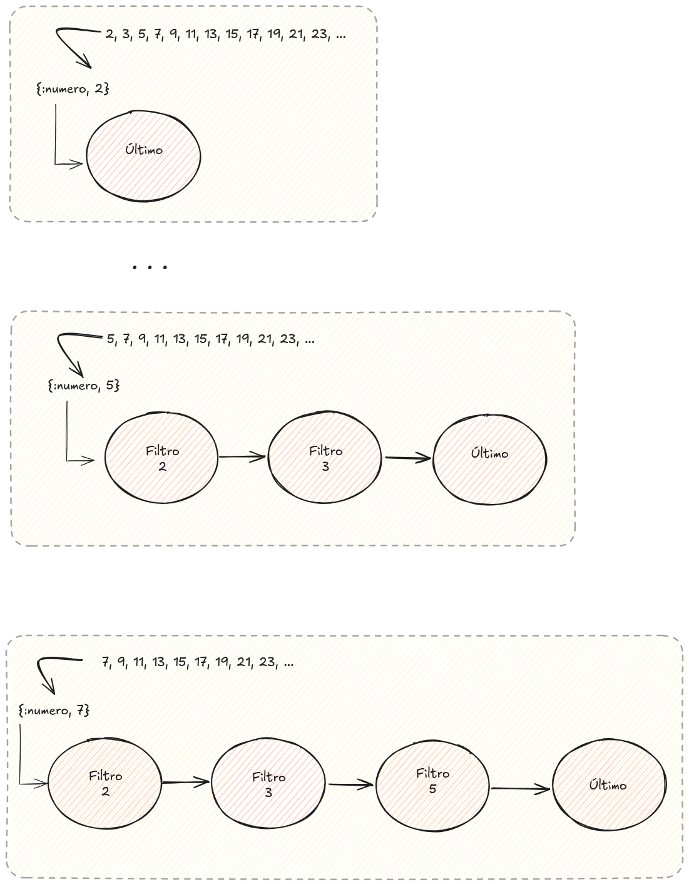

# Criba de Eratóstenes

En este ejercicio implementaremos dos adaptaciones de la [Criba de
Eratóstenes](https://es.wikipedia.org/wiki/Criba_de_Erat%C3%B3stenes).

En ambos casos tenemos la implementación constará de un módulo
`Eratostenes` con una función pública `primos(integer()) ::
list(integer())`


```elixir
defmodule Eratostenes do

  def primos(n) do
  end
  
end
```

Esta función recibe como parámetro un número natural `n` y devuelve
una lista de todos los números primos entre 2 y `n`.


## Versión secuencial

En esta versión la ejecución es completamente secuencial y no usamos
los procesos de _elixir_.

El algotirmo funciona de la siguiente manera:

1. Creamos una lista con todos los números desde 2 hasta `n`.

2. Cribamos la lista.

   a. El primer número de la lista, `p` es primo.
   
   b. Si el resto de la lista está vacío, hemos terminado.
   
   c. Filtramos el resto de números de la lista, descartando los que
      son divisibles por `p`. Si son divisibles por otro número, no
	  son primos.
  
   d. Cribamos la lista resultante del filtrado.
   

## Versión concurrente

En esta versión haremos uso de procesos como es habitual en las
aplicaciones de _elixir_. Por tanto la ejecución será concurrente.

El algoritmo se sigue basando en la idea original de la _Criba de
Eratostenes_, pero no es mismo que en la versión secuencial.

El algoritmo funciona de la siguiente manera:

1. Creamos una cola de procesos vacía.

   A los procesos de la cola los llamaremos `filtro`.
   
   Cada `filtro` guarda un número primo y la referencia al siguiente
   proceso en la cola.

2. Para cada número de la lista del 2 a `n`.

   a. Si la cola está vacía creamos un proceso filtro con ese número.
   
   b. Si la cola no está vacía, enviamos un mensaje con el número al
      primer filtro de la cola.
	  
	  Cada filtro cuando recibe un número, comprueba si es divisible
	  por su número primo.
	  
	  - Si es divisible, lo ignora.
	  
	  - Si no es divisible
	  
	    - Se lo envía al siguiente filtro de la cola.
	  
	    - Si es el último de la cola, crea un nuevo filtro al final de
	      la cola con el nuevo número.

3. Enviamos un mensaje de finalización al primer filtro de la cola.

4. Esperamos un mensaje con el resultado.


Los puntos que destacan en este algoritmo:

  - Los procesos se crean de forma dinámica y forman una lista, cola o
    _pipe_.

  - Cada proceso tiene un único enlace a su _siguiente_
    proceso. Excepto el último.

  - El proceso filtra todos los números que recibe.
  
  - Los procesos reciben los números de uno en uno.

  - Si un número pasa el filtro se envía al siguiente proceso.
  
  - _TIP_: La implementación es más sencilla si además de los procesos
   filtro, usamos un tipo especial de proceso que simplemente actua
   como final de la cadena.

  - Existen varias formas de recuperar la lista de primos. En el algoritmo
    no hemos especificado cómo hacerlo.
	
A continuación se muestra una ilustración con varios estados
intermedios de la cola de filtros:




