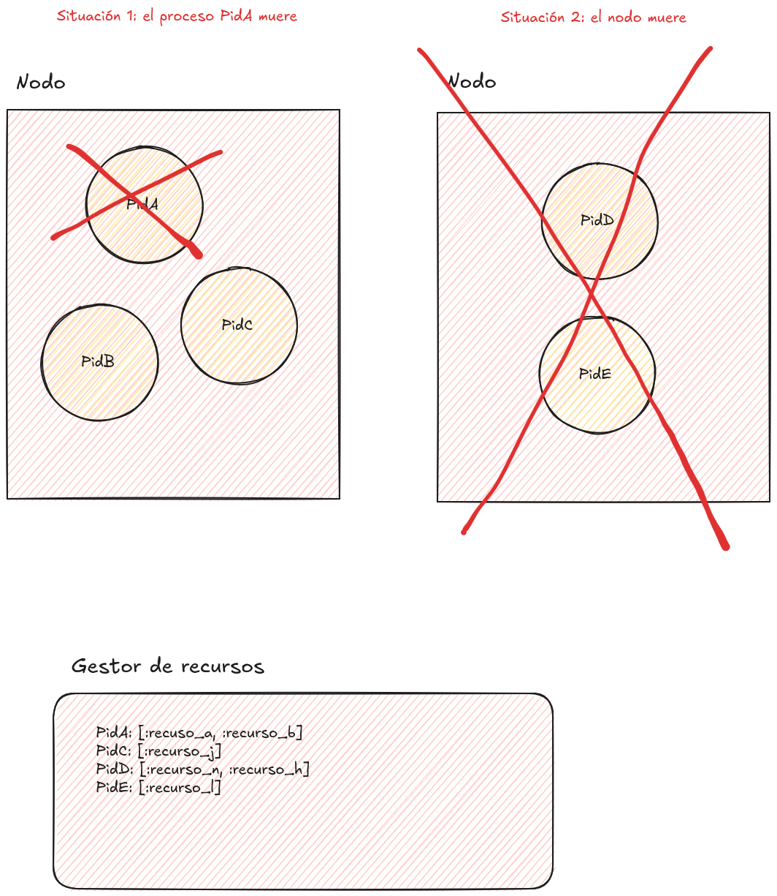

# Gestor de recursos

En este ejercicio comenzaremos por implementar un sencillo proceso que
gestione una lista de recursos.

A continuación pasaremos a realizar una segunda iteración con una
versión distribuida del gestor de recursos, para terminar en una
tercera iteración tolerante a fallos.

El resultado del ejercicio debe incluir los resultados de las tres
iteaciones. No es válido realizar únicamente la última iteración.

La naturaleza de los recursos no es relevante para el ejercicio. Lo
que nos interesa es la gestión de los mismos. Los _recursos_ los
representaremos como simples _átomos_ de elixir.

## Descripción del gestor

En este ejercicio desarrollaremos un servidor cuyo cometido es la
gestión de un conjunto de recursos. Los servicios son los siguientes:

  - `{:alloc, from}`, asigna un recurso al cliente. Devuelve a `from`:
  
    * `{:ok, recurso}`, si `recurso` es un recurso que se encuentra disponible,

      La elección del recurso a devolver es arbitraria. Por ejemplo,
      puede devolver el primer recurso disponible.

	* `{;error, :sin_recursos}` si no hay recursos disponibles.

	Una vez asignado, el recurso deja de estar disponible y no se
    puede asignar a ningún otro cliente hasta que sea liberado.

  - `{:release, from, recurso}`, libera un `recurso` previamente
    asignado al cliente. Devuelve a `from`:
	
	* `:ok` si la operación se lleva a cabo con éxito y el recurso
      queda disponible para nuevas asignaciones,
	
	* `{:error, :recurso_no_reservado}` si el recurso no había sido
      asignado al proceso `from`.

  - `{:avail, from}`, que devuelve el número de recursos disponibles
    en el servidor.

## Requisitos

- En el momento de iniciar el servidor, se le proporciona la lista de
  recursos disponibles inicialmente, p.e. `[:a, :b, :c, :d]`.

- Los recursos se asignan en un orden arbitrario.

- Para facilitar el envío de mensajes al servidor, el proceso se
  registra con el nombre `gestor`.

- El módulo ofrece una función `start/1` que inicia el gestor y lo
  registra con el nombre especificado.

- El módulo ofrece a los clientes un API con las funciones `alloc/0`,
  `release/1`, `avail/0` que encapsulan la interacción con el
  servidor.

- Como se indica anteriormente el gestor debe comprobar que el proceso
  que devuelve un recurso es el que, efectivamente, reservo el
  recurso.
  
- Un cliente puede reservar más de un recurso.
  

## Iteraciones

1. Versión no distribuida

  El gestor y los clientes se ejecutan en un mismo nodo.

2. Versión distribuida

  Se diferencia de la primera iteración en los siguientes aspectos:
  
  - Los clientes se ejecutan en nodos distintos a los del gestor.
  
  - El proceso gestor se debe registrar globalmente en la máquina
    distribuida de manera que este accesible para todos los nodos.
	
3. Versión tolerante a fallos

  Para esta iteración tenemos que tener en cuenta que los procesos
  cliente que han reservado un recurso pueden fallar antes de
  liberarlo. Si esto ocurriese en las iteraciones anteriores, el
  recurso no se liberaría nunca.

  Esta iteración se diferencia de la segunda iteración en el
  siguiente aspectos:
  
  - El gestor recupera los recursos asignados cuando un proceso
    cliente falla.
  
  :warning: Puede fallar un proceso cliente o puede fallar el nodo en
  que se ejecuta. El siguiente esquema ilustra ambos casos:

  
